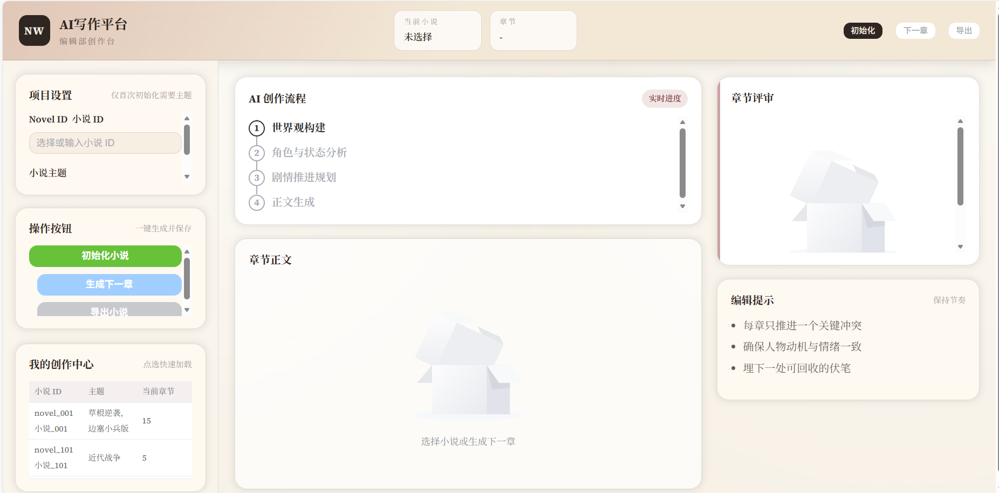

# AI写作平台

一个面向“小说自动创作”的前后端一体项目。前端提供创作工作台，后端基于 FastAPI + crewAI 多智能体流程进行小说初始化、续写、评审与导出，并将结构化结果写入数据库。

**主要功能**
1. 账号注册与登录（Token 鉴权）。
2. 小说初始化：生成世界观、人物、第一章正文与评审。
3. 续写下一章：带剧情分析、人物状态更新与评审。
4. 流式创作：支持分段输出标题与正文内容。
5. 小说导出：按章节导出为文本。

**技术栈**
1. 前端：Vue 3 + Vite + Element Plus + Pinia + Vue Router
2. 后端：FastAPI + SQLModel + MongoDB + crewAI
3. 向量与检索（可选）：Milvus + sentence-transformers

## 界面预览

## 目录结构说明

**仓库根目录**
1. `backend/` 后端服务与多智能体逻辑
2. `frontend/` 前端创作工作台
3. `package-lock.json` 根目录锁文件（可忽略，实际前端依赖在 `frontend/`）

**backend/**
1. `src/official_proj/api/` FastAPI 路由、鉴权与接口定义
2. `src/official_proj/config/` crewAI agents 与 tasks 的 YAML 配置
3. `src/official_proj/crews/` 多智能体组装与任务编排
4. `src/official_proj/db/` MySQL 与 MongoDB 的连接、DAO、模型
5. `src/official_proj/schema/` 任务输出的 Pydantic 结构
6. `src/official_proj/services/` 业务服务、流式解析、持久化逻辑
7. `src/official_proj/vector/` 向量化与 Milvus 记忆库（可选）
8. `src/official_proj/utils/` 通用工具函数
9. `knowledge/` 运行时生成的临时知识文件（会被清理）
10. `tests/` 后端测试

**frontend/**
1. `src/views/` 页面（登录页、创作台）
2. `src/components/` 组件（聊天式创作面板等）
3. `src/api/` 前端接口封装
4. `src/store/` Pinia 状态管理
5. `src/router/` 路由配置与守卫
6. `public/` 静态资源

## 本地部署（开发模式）

**前置环境**
1. Python 3.10+（推荐 3.10–3.13）
2. Node.js 18+
3. MySQL（默认使用 `novel_db` 数据库）
4. MongoDB（默认 `mongodb://localhost:27017/novel_db`）
5. Milvus（仅当使用向量记忆库功能时）

**后端启动**
1. 进入目录：`cd backend`
2. 安装依赖（任选其一）
   - `uv sync`
   - `pip install -e .`
3. 配置环境变量（`backend/.env`）
   - `MODEL` LLM 模型名
   - `OPENAI_API_KEY` API Key
   - `OPENAI_API_BASE` Base URL（如 DashScope 兼容模式）
4. 配置数据库
   - MySQL 连接在 `backend/src/official_proj/db/mysql_db/mysql.py` 中，需改成你的账号与库名
   - MongoDB 默认无需修改
5. 启动后端
   - `uvicorn official_proj.api.main:app --reload --host 0.0.0.0 --port 8000`

**前端启动**
1. 进入目录：`cd frontend`
2. 安装依赖：`npm install`
3. 启动开发服务器：`npm run dev`
4. 访问：`http://localhost:5173`

**接口与跨域**
1. 前端默认请求地址在 `frontend/src/api/request.js` 中配置为 `http://127.0.0.1:8000`
2. 后端 CORS 已放行 `http://localhost:5173`

## 运行说明与注意事项

1. 鉴权 Token 存在内存中（`api/auth/token_store.py`），服务重启会失效，生产环境需替换为持久化方案。
2. MySQL 用于用户与小说元信息，MongoDB 用于章节、世界观、评审、人物状态等内容。
3. 流式接口会产生临时知识文件，结束后由 `services/knowledge_cleanup.py` 自动清理。
4. 若使用向量记忆库，请确保 Milvus 服务可用，并检查 `src/official_proj/vector/` 相关实现与配置。

## API 概览（简要）

1. `POST /auth/register` 注册
2. `POST /auth/login` 登录（返回 token）
3. `POST /novel/init` 初始化小说（非流式）
4. `POST /novel/next_chapter` 生成下一章（非流式）
5. `POST /novel/init_stream` 初始化小说（流式）
6. `POST /novel/next_chapter_stream` 生成下一章（流式）
7. `GET /novel/status/{novel_id}` 查询章节进度
8. `GET /novel/list` 列表
9. `GET /novel/export/{novel_id}` 导出
